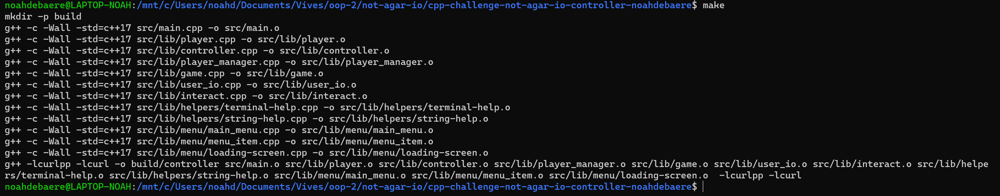
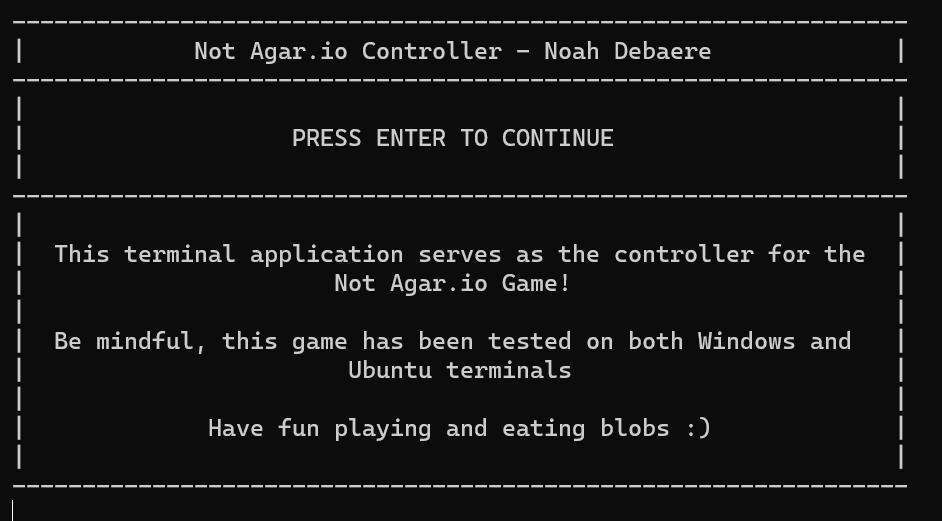
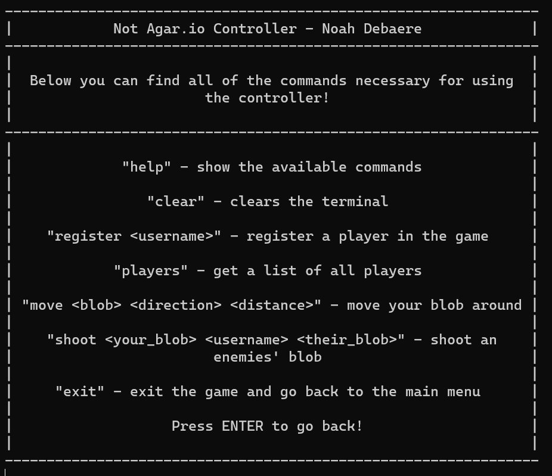
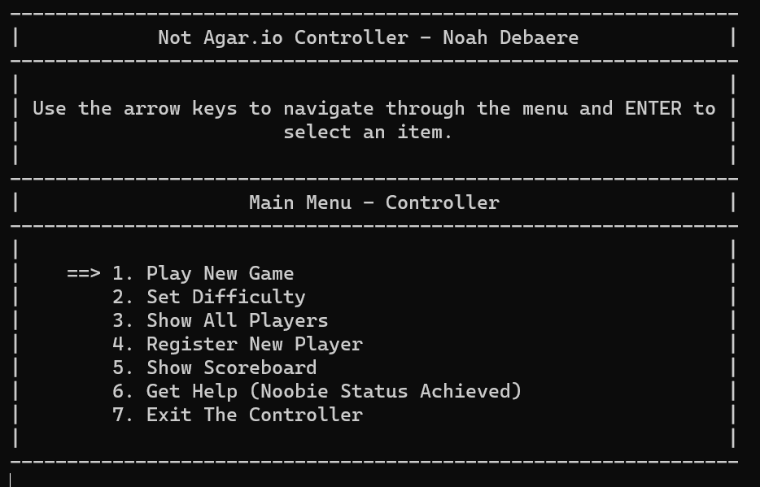
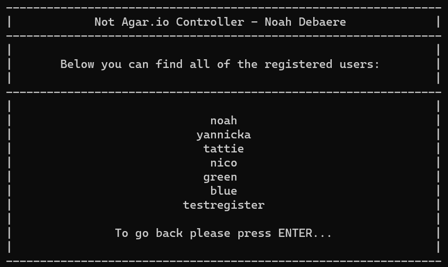
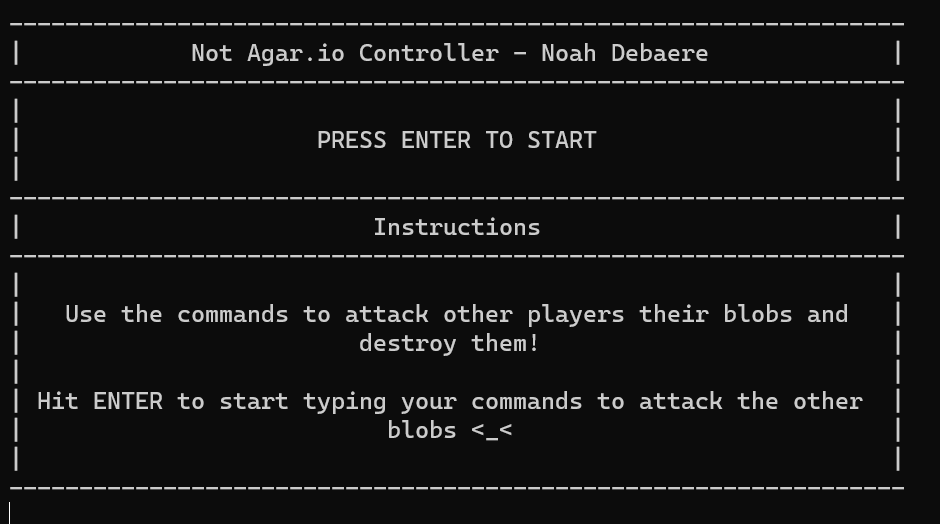
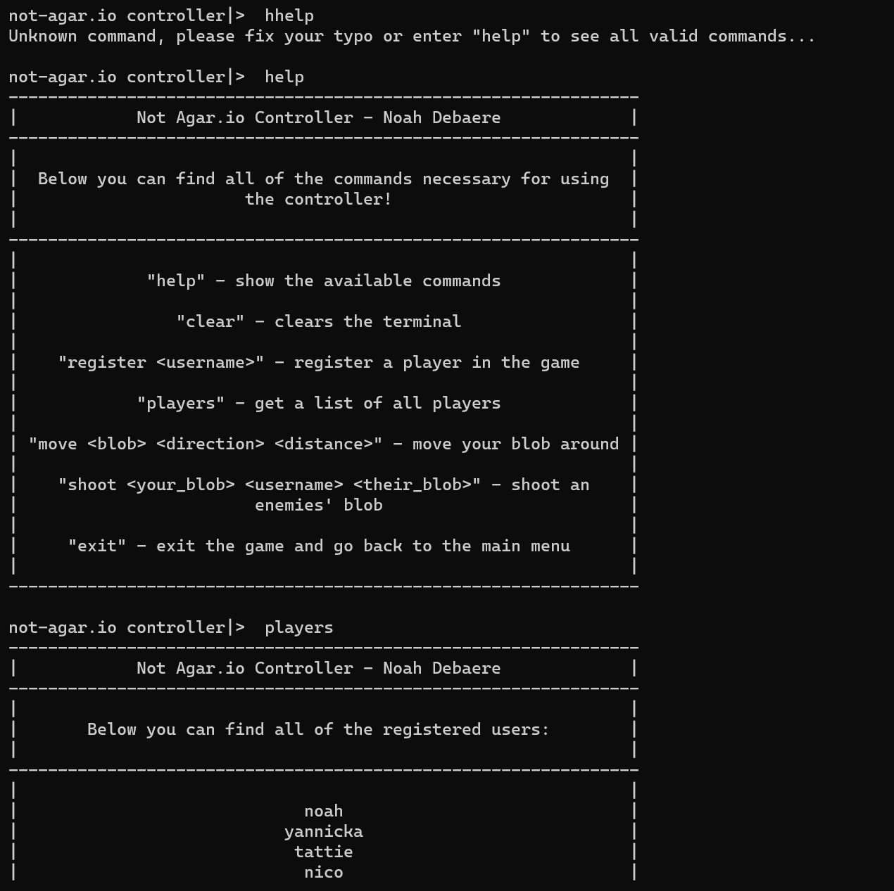
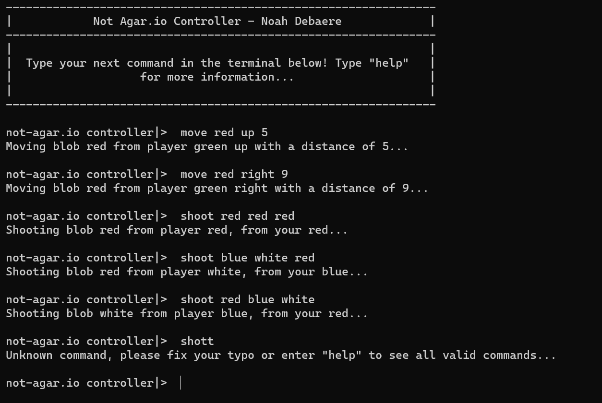
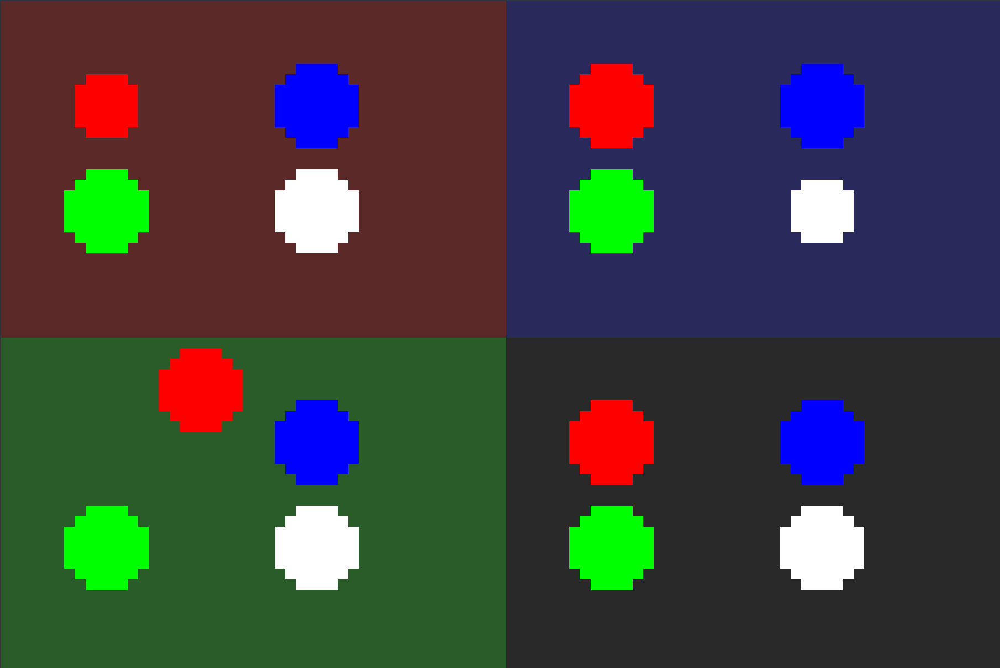
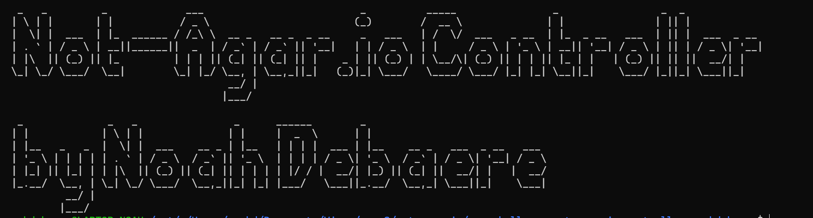

# Not Agar.io controller - Noah Debaere

## Description of the project

For the final practical project of the OOP2 (Object Oriented Programming 2) course at Vives Hogeschool Bruges, we were assigned to create a C++ application that can be used as a controller. Not just any controller, but one for the [Not-Agar.io](https://github.com/BioBoost/not-agar.io) game. This game is inspired by the well-known [Agar.io](https://agar.io/) game and was created by our teacher Nico De Witte.

The basic idea of the project is having a game, that you can run locally on your computer, that is controlled by a CLI (Command Line Interface). You have to type the command that needs to be executed, not like many of the games we are used to today - with al the fancy dancy graphics and user interfaces. Just a basic terminal controller for the everyday regular game-geek.

Scroll down to the [setup instructions](#how-to-setup-the-controller) to see how you can setup the controller and start playing...

## How to setup the controller

First of all you have to make sure you are already running both the frontend and backend for the game. You can find the frontend [here](https://github.com/BioBoost/not-agar.io) and the backend [here](https://github.com/BioBoost/not-agar.io-backend) as well as the instructions to install and run them. Do mind that the best way to run the controller, is in an Linux/Unix environment.

Next you have to clone this repository to start...

```bash
# Use this code for HTTP
mkdir not-agar-io-controller
cd not-agar-io-controller
git clone https://github.com/vives-oop2-2021/cpp-challenge-not-agar-io-controller-noahdebaere.git .

# Use this code for SSH
mkdir not-agar-io-controller
cd not-agar-io-controller
git clone git@github.com:vives-oop2-2021/cpp-challenge-not-agar-io-controller-noahdebaere.git .
```

After cloning the repository we have to install some additional libraries. We are using cURLpp, which is a C++ wrapper class for the libcURL library.

```bash
sudo apt-get install pkg-config libcurlpp-dev libcurl4-openssl-dev
```

If you are running the controller and game in a Windows environment or OS, you can install the libraries through the instructions [here](https://curl.se/libcurl/).

After the repository has been cloned and the libraries have been installed you can setup and run the project with the code below.

```bash
make
build/controller
```

Remark: do note that when adding the libraries to your project on a Windows OS, the makefile might need to be changed to include the libraries and their correct path.

Finally when compilation was succefull through using make you should see something like this:





### In-Game Commands

When entering the game you can use the main menu to check the help page for more information on the commands. This can also be done by executing the **help** command in the terminal. You should see something like this:



All of the commands are also listed below once more for your convenience.

* `help`: show some help for the user about the commands that are available
* `exit`: exit the game
* `register <playername>`: register a player in the game
* `players`: get a list of the playernames and their positions
* `move <blob> <direction> <distance>` move one of your blobs (red, green, blue, white) towards a direction (up, down, left, right) for a distance (unsigned integer).
* `shoot <your_blob> <playername> <their_blob>`: shoot a blob of another player with one of your blobs.

## Some screenshots

Below you can find some screenshots of the controller...

### Main Menu



### The Players list



### Game Instructions



### Playing the actual game itself







### Exiting the controller



## Possible expansions of the controller

There are still some expansion possible for the controller:

* First and foremost right now it is only possible to play as the username matching the colors on the website. So only players with the name red, green, blue ... It is already possible to register other users, but they are not linked to a certain square in the field.
* There needs to be more error handling. Sometimes the user can still quit the program when entering wrong commands... So more validation and checks...
* There is no trackrecord of scores or an implementation of a scoreboard. This is fun and should be added later on...
* User should be able to login using username and password? Using a database to collect this data is possible.
* Different difficulties can be added to make the game more complex for the more veteraned/experienced players.
* Optimisation of the code is still good. I tried to code everything as 'OOP' as possible, but a big review might help to rewrite some stuff.
* Adding a more easy way to run the controller in a Windows environment or OS...

## Conclusion

In conclusion this project has been a lot of fun. Creating something we use everyday, one way or another, in games has been challenging but very nice to see this final result. We also have been working a lot with API's and HTTP request the last couple of years, so implementing this in C++ code was refreshing as well.

## Resources

Below you can find some of the resources I used during this project:

* The Main Menu layout and design was slightly inspired by a project we were making last year. We then had to code a game like snake or something like a chatbot, but due to circumstances I was not able to complete the coding challenge last year. I reused some of my code I'd had written back then.
* [libcURL library](https://curl.se/libcurl/)
* [cURLpp Wrapper Class](https://www.curlpp.org/)
* [cURLpp Guide](https://github.com/jpbarrette/curlpp/blob/master/doc/guide.pdf)
* [cURLpp Latest Release](https://github.com/jpbarrette/curlpp/releases/tag/v0.8.1)
* [cURLpp POST Example](https://github.com/jpbarrette/curlpp/blob/master/examples/example12.cpp)
* [cURLpp introduction](https://github.com/jpbarrette/curlpp/blob/master/examples/example12.cpp)
* [Adding cURLpp libraries](https://stackoverflow.com/questions/43541759/how-to-add-library-curlpp-to-c-project)
* [HTTP Requests in C++](https://stackoverflow.com/questions/1011339/how-do-you-make-a-http-request-with-c)
* [cURLpp for Windows](https://stackoverflow.com/questions/42376752/how-can-i-build-curlpp-on-windows-for-gcc)
